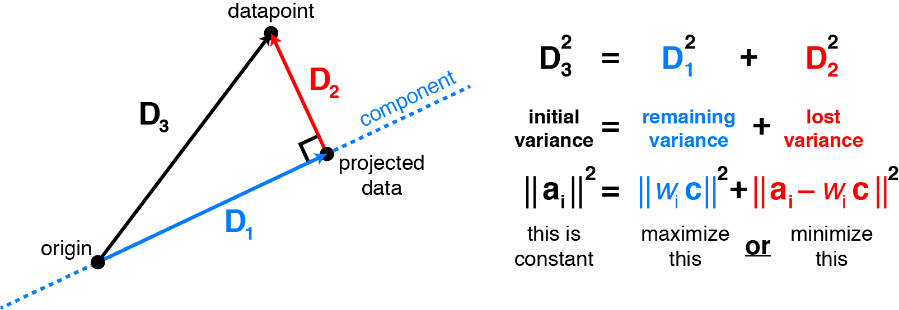

# 百面机器学习

$$\def\bm#1{\boldsymbol{#1}}$$

## 第一章 特征工程

### 特征归一化

- 为什么要做归一化？

> 1. 对不同单位的特征进行比较
> 2. 在梯度下降类型的算法中，可以加速收敛

- 如何归一化？

> 线性函数归一化（minmax scaling），零均值归一化（standardization）

### 类别型特征

- 如何编码？
> 序号编码：0，1，2
> 
> One-hot编码：（0，0，1），（0，1，0），（1，0，0），优点：稀疏矩阵形式节省空间；
> 
> 二进制编码：001，010，011，所需维数少于One-hot编码，进一步节省空间
> 

### 组合特征

- 如何组合特征？如何有效找到组合特征？
> 将有限类别的特征进行组合。如A特征有a，b两种取值，B特征有c，d两种取值，可以组合成(a,c), (a,d), (b,c), (b,d)四种特征
> 
> - 采用决策树方法找到特征：每个叶子节点对应一种决策路径，也可以作为一种特征，相应叶子节点上的样本可以采用One-hot编码方式将相应的特征取为1。
> 

### 图像数据不足的处理方法

- 颜色变换？

## 第二章 模型评估

- Presicion-Recall曲线与ROC曲线的优劣
> P-R曲线：Precision = TP/(TP + FP)，Recall = TP/(TP + FN)
>
> ROC曲线：TPR = TP/(TP + FN) = Recall，FPR = FP/(TN + FP)
>
> Recall即TPR。从概率观点来看，Precision是分类器预测的阳性样本是真阳性的概率，根据贝叶斯公式
>
> $\begin{aligned} p(x=T|x=P) & = \frac{p(x=P|x=T) \cdot p(x=T)}{p(x=P)} \\ & = \frac{p(x=P|x=T) \cdot p(x=T)}{p(x=P|x=T)\cdotp(x=T) + p(x=P|x=F)\cdot p(x=F)} \\ & = \frac{p(x=P|x=T)}{p(x=P|x=T) + p(x=P|x=F)\cdot p(x=F)/p(x=T)} \\ & = \frac{TPR}{TPR + FPR\cdot p(x=F)/p(x=T)} \end{aligned}$
>
> 可见，Precision依赖于样本中阳性的比率，如果阳性比例比较低，Precision很下降。

## 第四章 降维

#### PCA

- **最大化投影方向的方差**

设有一组去中心化后的$p$维数据向量$(x_1, x_2, \cdots, x_n)$，写成矩阵形式$\bm{X} \in \mathcal{R}^{n\times p}$，PCA的想法是首先寻找一个投影方向$\omega$，使得数据在这个方向上的投影的方差最大，即

$$\left\{ \begin{array}{l} \hat{\omega} = \underset{\omega}{\mathrm{argmax}} \sum\limits_{i=1}^n (\omega^T x_i)^2 \\ \text{s.t.  } \omega^T\omega = 1\end{array} \right.$$.

以上优化问题可以写为

$$\begin{aligned} \hat{\omega} & = \underset{\omega}{\mathrm{argmax}} \left[ \sum\limits_{i=1}^n (\omega^T x_i)^2 \right] \\ & = \underset{\omega}{\mathrm{argmax}} \left[ \sum\limits_{i=1}^n \omega^T x_ix_i^T \omega \right]\\ & = \underset{\omega}{\mathrm{argmax}} \left[ \omega^T (\sum\limits_{i=1}^n x_i x_i^T) \omega \right] \\ & = \underset{\omega}{\mathrm{argmax}}\left[ \omega^T \bm{X}^T \bm{X} \omega\right] \end{aligned}$$

注意到$\bm{X}^T\bm{X}$/(n-1) 即样本的协相关矩阵（数据已去中心化）。为了求解包含约束的优化问题，引入含拉格朗日乘子的函数

$$F(\omega) = \omega^T \bm{X}^T\bm{X}\omega - \lambda \omega^T \omega + \lambda$$

对$\omega$求导得到，

$\frac{\partial F}{\partial \omega} = 2 \bm{X}^T\bm{X}\omega -2\lambda\omega$

导数为零时取得极值，即

$\bm{X}^T\bm{X} \hat{\omega} = \lambda\hat{\omega}$

二阶导数为$\frac{\partial^2 F}{\partial \omega\partial \omega} = 2\bm{X}^T\bm{X} - 2\lambda \bm{I}$（因为$\lambda$为$\bm{X}^T\bm{X}$的最大特征值，$\bm{X}^T\bm{X}-\lambda\bm{I}$的特征值非正，因此$\bm{X}^T\bm{X}-\lambda\bm{I}$为半负定矩阵。）

因此，$F(\omega)$取得极值的方向即$\bm{X}^T\bm{X}$的特征方向，此时$F(\omega) = \lambda$为特征值，所以$\hat{\omega}$即为$\bm{X}^T\bm{X}$的最大特征值对应的特征向量。

将上一步得到的$\hat{\omega}$设为$\hat{\omega_1}$，接下来，寻找一个新的投影方向$\omega_2$，要求数据在这个方向上投影的方差最大，同时$\omega_2$与$\omega$正交，即

$$\left\{ \begin{array}{l} \hat{\omega}_2 = \underset{\omega_2}{\mathrm{argmax}} \sum\limits_{i=1}^n (\omega_2^T x_i)^2 \\ \text{s.t.  } \omega_2^T\omega_2 = 1 \text{ and } \omega_2^T \omega_1 =0 \end{array} \right.$$.

类似地，采用拉格朗日乘子法，得到

$$F(\omega_2) = \omega_2^T \bm{X}^T\bm{X}\omega_2 - \lambda \omega_2^T \omega_2 + \lambda + \phi\omega_2^T \omega_1$$

对$\omega_2$求偏导，

$\frac{\partial F}{\partial \omega_2} = 2 \bm{X}^T\bm{X}\omega_2 -2\lambda\omega_2 + \phi\omega_1=0$

两端乘以$\omega_1^T$，得到

$\phi = -2\omega_1^T\bm{X}^T\bm{X}\omega_2 = -2 \omega_2^T\bm{X}^T\bm{X}\omega_1=-2\lambda_1\omega_2^T\omega_1 = 0 $

此时，同样地

$\bm{X}^T\bm{X}\omega_2 = \lambda\omega_2$

即$\omega_2$为$\bm{X}^T\bm{X}$的第二大特征值对应的特征方向。

以此类推，得到$\omega_3,\cdots, \omega_d$。

- **最小化平方误差**

设有一组去中心化后的$p$维数据向量$(x_1, x_2, \cdots, x_n)$，写成矩阵形式$\bm{X} \in \mathcal{R}^{n\times p}$。我们希望找到一组正交基向量（$\omega_1, \cdots, \omega_d$）（对应一个$d$维子空间 $\bm{W} = (\omega_1, \cdots, \omega_d) \in \mathcal{R}^{p \times d}$），使得数据向量在这个子空间的投影向量$\bm{W}\bm{W}^Tx_i$与原向量的差的平方和最小。投影向量也可以看做是$\bm{X}$在子空间的重构向量，所以优化目标也就是最小化重构误差（reconstruction error）。写成数学形式，即

$$\begin{aligned} W & = \underset{W}{\mathrm{argmin}}\left[ \sum\limits_{i=1}^n ||\bm{W}\bm{W}^Tx_i -x_i||^2 \right] \\ & = \underset{W}{\mathrm{argmin}}\left[ \sum\limits_{i=1}^n (\bm{W}\bm{W}^Tx_i -x_i)^T (\bm{W}\bm{W}^Tx_i -x_i) \right] \\ & = \underset{W}{\mathrm{argmin}}\left[ \sum\limits_{i=1}^n (x_i^T \bm{W}\bm{W}^T \bm{W} \bm{W}^T x_i -x_i^T \bm{W}\bm{W}^Tx_i - x_i^T \bm{W}\bm{W}^Tx_i + x_i^T x_i) \right] \\ (\bm{W}^T\bm{W}=\bm{I}_d) & = \underset{W}{\mathrm{argmin}}\left[ \sum\limits_{i=1}^n ( - x_i^T \bm{W}\bm{W}^Tx_i + x_i^T x_i) \right] \\ (x_i^T x_i = \mathrm{const.}) & = \underset{W}{\mathrm{argmin}}\left[ \sum\limits_{i=1}^n ( - x_i^T \bm{W}\bm{W}^Tx_i) \right] \\ & = \underset{W}{\mathrm{argmax}}\left[\sum\limits_{i=1}^n \mathrm{tr}( x_i^T \bm{W}\bm{W}^Tx_i) \right] \\ & = \underset{W}{\mathrm{argmax}}\left[\sum\limits_{i=1}^n \mathrm{tr}( \bm{W}^Tx_i x_i^T \bm{W})\right] \\ & = \underset{W}{\mathrm{argmax}}\left[\mathrm{tr}\left(\sum\limits_{i=1}^n \bm{W}^Tx_i x_i^T \bm{W}\right)\right] \\ & = \underset{W}{\mathrm{argmax}}\left[\mathrm{tr}\left( \bm{W}^T \bm{X}^T \bm{X} \bm{W}\right)\right] \\ & = \underset{W}{\mathrm{argmax}}\left[\left( \sum\limits_{i=1}^d \omega_i^T \bm{X}^T \bm{X} \omega_i\right)\right] \end{aligned}$$

与最大投影方差类似，我们可以依次找到$\omega_1,\cdots,\omega_d$的方向，注意$\omega_1$不需要正交约束。那么下一个问题是如何证明这种贪心算法得到的解就是最优解？

可以通过数学归纳法来证明：首先，当$d=1$时，显然结论成立；然后，归纳假设为$d=k-1$时，以上方法得到的特征向量$(\omega_1, \cdots, \omega_{k-1})$是最优解；$d=k$时，假设存在一组基$(\omega'_1, \cdots, \omega'_k)$是最优解，注意到对$(\omega'_1, \cdots,\omega'_k)$做线性组合得到新的线性无关的基向量，重构误差不变。例如，对矩阵$\bm{W}$右乘一个单位正交矩阵$\bm{V}$（即$d$维空间的线性变换），投影矩阵变为

$\bm{W}\bm{V}(\bm{W} \bm{V})^T = \bm{W}\bm{V}\bm{V}^T\bm{W}^T = \bm{W}\bm{W}^T$

最后一个等号是因为$\bm{V}\bm{V}^T = \bm{I}$。我们希望找到一组基向量，其中$\omega_d'$与$(\omega_1,\cdots,\omega_{k-1})$正交（这一点总是可以做到的，因为$(\omega_1', \cdots,\omega_k') \in \mathcal{R}^k, (\omega_1', \cdots,\omega_{k-1}) \in \mathcal{R}^{k-1}$）。在以上的优化算法中，$\omega_k$是第$k$大的特征值对应的特征向量，也是在满足约束条件$\omega_k$与$(\omega_1,\cdots,\omega_{k-1})$正交时的最优解，因此优化函数$F(\omega_k) \geq F（\omega_k'）$。同时，根据$k-1$时的归纳假设，$(\omega_1,\cdots,\omega_{k-1})$是$d=k-1$时的最优解，那么$(\omega_1,\cdots,\omega_k)$即为$d=k$时的最优解。

([https://zhuanlan.zhihu.com/p/59889028](https://zhuanlan.zhihu.com/p/59889028)，[https://stats.stackexchange.com/questions/102658/why-does-pca-maximize-total-variance-of-the-projection](https://stats.stackexchange.com/questions/102658/why-does-pca-maximize-total-variance-of-the-projection)）

Two different views of PCA.  [http://alexhwilliams.info/itsneuronalblog/2016/03/27/pca/.](http://alexhwilliams.info/itsneuronalblog/2016/03/27/pca/)

Maximizing variance in principal component space is equivalent to minimizing least-squares reconstruction error..  [http://alexhwilliams.info/itsneuronalblog/2016/03/27/pca/.](http://alexhwilliams.info/itsneuronalblog/2016/03/27/pca/)

- 数据去中心化可以简化优化问题的表达式，否则$$\hat{\omega} = \underset{\omega}{\mathrm{argmax}} \left[ \sum\limits_{i=1}^n (\omega^T x_i - \omega^T \sum x_i/n)^2 \right]$$。可以定义$\tilde{x}_i = x_i - \sum x_i/n$变为之前的形式。

